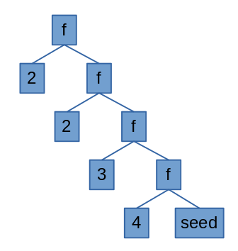

Title: How to get unique values in an Elm list?
Date: 2021-01-28
tags: Elm

You do it like this:

```elm
unique : List a -> List a
unique l =
    let
        incUnique : a -> List a -> List a
        incUnique elem lst =
            case List.member elem lst of
                True -> lst
               False -> elem :: lst
    in
        List.foldr incUnique [] l
```

There you go. Have fun!

---

Oh, still here? Let’s see what this is doing then.

So, you have a list in Elm and you want to get the unique values in it. And there is no way to write a simple imperative loop to iterate over the list. List.fold to the rescue. We have 2 folds we can use: *foldl* (fold left) and *foldr* (fold… you can figure it out). The left and right refer to the associativity of the operation.

Say you have the list [2, 2, 3, 4]. If you fold the list, it means you’ll go over the list pairing 2 items and applying some function, e.g. folding this list with the + operation would get us:

```elm
( 2 + ( 2 + ( 3 + ( 4 ) ) ) )
```



This is right associativity, by the way, so I did a foldr. We can see more 
clearly what’s going on looking at the diagram. There, our function *f* is the *+* operation and our seed is *0*.

The foldl would look like this:

```elm
( ( ( ( 2 ) + 2 ) + 3 ) + 4 )
```

In Elm we have *List.foldl* and *List.foldr*.
 In addition to the function to apply and the list, we also have to 
supply a seed value to apply to the first element of the list, e.g. if 
our seed was 0, we’d have a foldr like this:

```elm
( 2 + ( 2 + ( 3 + ( 4 + 0) ) ) )
```

This
 is how folding works. We can use it for more advanced data structure 
traversal, but we’ll only use it to find unique values here. We will 
start with an empty list (our seed) and check if the elements in the 
original list are n this new list. If they are, we do nothing. If they 
are not, we add them to that list (or rather we create a new list with 
the elements of that list plus the new element, since there’s is no 
mutability in Elm land).

Let’s define our function:

```elm
incUnique : a -> List a -> List a
incUnique elem lst =
 case List.member elem lst of
 True -> lst
 False -> elem :: lst
```

This function receives a list element and a list. If the element is a member of that list, it returns the list. If it’s not, it returns a new list containing all the elements of the received list plus the received 
element. Then we use the fold with this function.

```elm
someList = [ 2, 2, 3, 4]
List.foldr incUnique [] someList
```

Here’s what’s happening

```elm
( incUnique 2 ( incUnique 2 ( incUnique 3 ( incUnique 4 [] ) ) ) )
( incUnique 2 ( incUnique 2 ( incUnique 3 [4] ) ) )
( incUnique 2 ( incUnique 2 [3, 4] ) )
( incUnique 2 [2, 3, 4] )
( [2, 3, 4] )
```

See, we’re folding from the right. What if we folded from the left?

```elm
( incUnique 4 ( incUnique 3 ( incUnique 2 ( incUnique 2 [] ) ) ) )
( incUnique 4 ( incUnique 3 ( incUnique 2 [2] ) ) )
( incUnique 4 ( incUnique 3 [2] ) )
( incUnique 4 [3, 2] )
( [4, 3, 2] )
```

It’s less clear that we’re folding from the left because the list element is always the left operand of the function. This caused the list to look inverted in the expression. As it turns out, our final result also inverts the original list, with the duplicates removed. This is because our function *incUnique* adds new elements to the front of the list. If it added to the back of the list, *foldr* would invert the list and *foldl* would preserve order. Go back to the diagram above and imagine what it would like for a left fold.

Putting it all together:

```elm
unique : List a -> List a
unique l =
    let
        incUnique : a -> List a -> List a
        incUnique elem lst =
		case List.member elem lst of
			True -> lst
			False -> elem :: lst
     in
	List.foldr incUnique [] l
```

What do you think? How would you improve on this? Drop me a message at [blog@diogoaos.com](mailto:blog@diogoaos.com).
